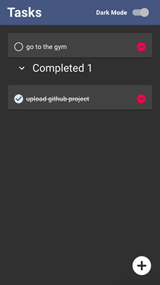

<!-- PROJECT LOGO -->
<br />
<p align="center">
  <a href="https://github.com/ayoub-g/todoList-frontend.git">
    
  </a>

  <h3 align="center">Todo App</h3>

  <p align="center">
    A basic and awesome todo app, built with React, Redux, RTK, Node, GraphQl and more 🥳
    <br />
    <a href="https://github.com/ayoub-g/todoList-frontend"><strong>Explore the docs »</strong></a>
    <br />
    <br />
    <a href="https://apps.ayoubgharbi.com/todo">View Demo</a>
    ·
    <a href="https://github.com/ayoub-g/todoList-frontend/issues">Report Bug</a>
    ·
    <a href="https://github.com/ayoub-g/todoList-frontendissues">Request Feature</a>
  </p>
</p>
<!-- TABLE OF CONTENTS -->
<details open="open">
  <summary>Table of Contents</summary>
  <ol>
    <li>
      <a href="#description">Description</a>
      <ul>
        <li><a href="#built-with">Built With</a></li>
      </ul>
    </li>
    <li>
      <a href="#getting-started">Getting Started</a>
      <ul>
        <li><a href="#prerequisites">Prerequisites</a></li>
        <li><a href="#installation">Installation</a></li>
      </ul>
    </li>
    <li><a href="#license">License</a></li>
    <li><a href="#contact">Contact</a></li>
    <li><a href="#acknowledgements">Acknowledgements</a></li>

  </ol>
</details>

## Description

<p align="center"></p>

Todo is a basic todo app with a sleek interface, you can add and remove tasks, no task update for this version 🙁 through this app you will learn a lot:

- How to use css-in-js in react with the latest material version
- How manage app global state with redux and RTK
- How to seperate side effect logic from components
- How asynchronous functions can communicate with redux using redux-thunk
- How to improve app performance with selectors
- How to write clean and maintainable code

## Built with

**Frontend:**

- [React](https://reactjs.org)
- [Redux](https://redux.js.org/)
- [RTK](https://redux-toolkit.js.org/rtk-query/overview)
- [Reselect](https://github.com/reduxjs/reselect#readme)
  #### Reselect is a selector library for redux, it improves code performance by computing selectors only when input data changes
- [Material ui](https://material-ui.com/)

**Backend:**

- [node.js](https://nodejs.dev)
- [express.js](https://expressjs.com)
- [graphql](https://graphql.org)
- [sequelize](https://sequelize.org)
- [postgres](https://www.postgresql.org)

<!-- GETTING STARTED -->

## Getting Started

### Prerequisites

##### To use this project you need to install npm and postgres

### Installation

1. clone the front-end repository (this repository)

```sh
git clone https://github.com/ayoub-g/todoList-frontend.git
```

2. clone the backend repository

```sh
git clone https://github.com/ayoub-g/todo-server
```

3. cd to todo-server
```sh
cd todo-server
```

4. install npm dependencies

```sh
npm install
```

5. configure the database for local environment :

set environment variable to local 

go to the file `data/getConnectionString.js` and create a postgres user and a database with the configuration described in the file or update it with your own configuration
```js

const getConnectionString = async () => (
  stage === 'local' ?
    {
      host: 'localhost',
      database: 'todoapp',
      port: '5432',
      username: 'testuser',
      password: 'HbdEvgmtGUc98T',
    } : await getRemoteConfig());
```

5. start the server

```sh
npm start
```

if everything is ok, you should see in the terminal that the server is running on port 3001, and sequelize has created the todos table.

6. now it's time to configure the frontend, cd to the front-end repository

```sh
cd ../todoList-frontend
```

7. install npm dependencies

```sh
npm install
```

1.  run the project, this will run the dev server at port 3000

```sh
npm start
```

12. open a new tab at http://localhost:3000

<!-- LICENSE -->

## License

Distributed under the MIT License. See `LICENSE` for more information

<!-- CONTACT -->

## Contact

Ayoub Gharbi - [@AyyoubGharbi](https://twitter.com/AyyoubGharbi) - gharbi.ayoub@gmail.com

Project Link: [https://github.com/ayoub-g/todoList-frontend](https://github.com/ayoub-g/todoList-frontend)

<!-- ACKNOWLEDGEMENTS -->

## Acknowledgements

Project icon

<div>Icons made by <a href="https://www.freepik.com" title="Freepik">Freepik</a> from <a href="https://www.flaticon.com/" title="Flaticon">www.flaticon.com</a></div>